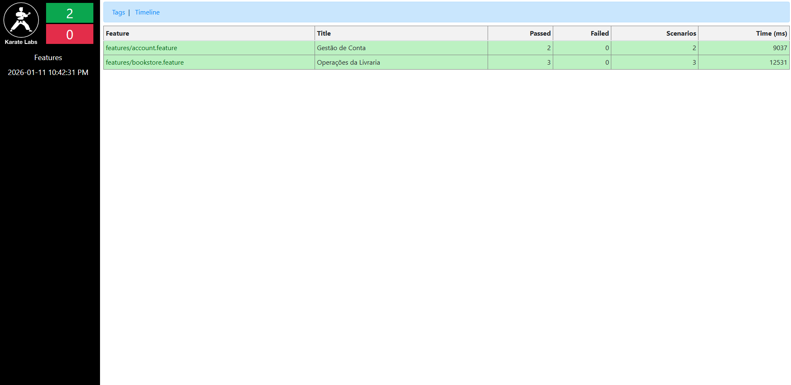

<div align="center">

  

## BookStore API Automation 

  <h3>
  Accenture  Academy QE 2026
  </h3>

  <br>

[](https://github.com/K0V4K/Accenture-Karate-DSL-Book-Store-API)
[](https://www.oracle.com/java/)
[](https://www.karatelabs.io/)
[](https://opensource.org/licenses/MIT)

  <p align="center">
    <i>Automação de testes de API ponta a ponta desenvolvida com Karate DSL para o desafio técnico da Accenture.</i>
  </p>

</div>

---

## Arquitetura do Projeto

O projeto segue o padrão de **Separação de Responsabilidades (SoC)**, organizando os testes por domínios de negócio e isolando lógicas repetitivas em helpers modulares.

```text
src/test/java
├── features
│   ├── account.feature <-Ciclo de Vida do Usuário (CRUD & Token)
│   ├── bookstore.feature <-Gestão de Catálogo e Coleção (E2E)
│   └── helpers
│       └── auth.feature <-Reutilizável: Autenticação e Geração de Token
├── karate-config.js <-Configurações Globais e Massa Dinâmica
└── TestRunner.java <-Executor JUnit 5

```


# Automation | Karate DSL

Este projeto foca na automação de testes de API utilizando o framework **Karate DSL**, cobrindo fluxos críticos de gestão de conta e operações de livraria. A solução foi desenhada para ser modular, escalável e de fácil manutenção, aproveitando a sintaxe Gherkin para facilitar a leitura.

## API utilizada

* *Bookstore demoqa swagger UI:* Plataforma REST para simulação de fluxos de livraria e validação de contratos de API.

---

## Tecnologias & Dependências

* **Java 17**: Ambiente de execução (LTS).
* **Karate DSL (1.4.1)**: Framework principal que combina automação de API com a semântica BDD.
* **Maven**: Gerenciamento de dependências e automação de build.
* **JUnit 5**: Motor de execução e integração com pipelines de CI/CD.
* **Gherkin**: Linguagem utilizada para escrita dos cenários (`Given`, `When`, `Then`), garantindo que os testes sejam legíveis tanto para desenvolvedores quanto para analistas de negócio.

---

## Ambiente de Desenvolvimento & Plugins

Para uma experiência de desenvolvimento otimizada, recomenda-se:
* **IDE**: [IntelliJ IDEA](https://www.jetbrains.com/idea/) (recomendado para melhor suporte ao Karate).
* **Plugins**:
* **Cucumber for Java**: Para suporte à sintaxe Gherkin e realce de palavras-chave.
* **Gherkin**: Habilita o realce de sintaxe para formatação dos cenários de teste
* **Karate Runner**: Essencial para executar cenários diretamente da IDE e depurar (`debug`) as features de forma individual.

---

## Requisitos e Diferenciais Implementados

O projeto entrega 100% dos requisitos solicitados, incluindo as seguintes implementações técnicas:

### 1. Gestão de Conta (`account.feature`)
* **Criação de Usuário e Token**: Implementado através de um helper reutilizável (`auth.feature`), evitando duplicação de código.
* **Massa de Dados Dinâmica**: O `userName` é gerado via JavaScript (`System.currentTimeMillis()`) no arquivo `karate-config.js`, o que permite rodar a suite de testes múltiplas vezes sem conflitos de dados.
* **Validações de Segurança (DELETE)**:
* ✅ **Sucesso (204)**: Exclusão de usuário autenticado com token válido.
* ❌ **Falha (401)**: Validação de erro ao tentar excluir sem token de acesso.

### 2. Operações de Livraria (`bookstore.feature`)
* **Fluxo End-to-End (E2E)**:
* **GET /Books**: Listagem do catálogo com validação rigorosa de **JSON Schema** (`#string`, `#number`) para garantir o contrato da API.
* **Captura Dinâmica**: O teste extrai ISBNs diretamente da resposta do catálogo para uso nos passos subsequentes.
* **POST /Books**: Adição de livros à coleção do usuário.
* **PUT /Books**: Atualização dinâmica de livros na coleção.
* **Data Driven Testing**: Utilização de `Scenario Outline` com tabelas de `Examples` para testar múltiplos cenários de busca (sucesso e erro) em um único bloco lógico.

---

## Decisões Técnicas

* **Modularização com `call read`**: A lógica de autenticação é isolada. O `Background` das features chama o `helpers/auth.feature`, garantindo que cada cenário tenha um `userId` e `token` válidos e independentes.
* **Data Cleanup**: O fluxo de conta garante a deleção do usuário ao final do ciclo, evitando o acúmulo de dados desnecessários no ambiente de testes.

---

## Como Executar o Projeto

### Pré-requisitos
* Java JDK 17 ou superior.
* Maven configurado no sistema.

### Execução via Terminal
Abra a raiz do projeto e execute o comando abaixo:

```bash
mvn clean test
```
### Execução via Diretório
Abra a raiz do projeto e faça o passo a seguir:

```bash
Src -> Test -> Java -> TestRunner.java ->  Botão direito do mouse Run "TestRunner"
```
---

## Evidências e Relatórios
**O Karate gera relatórios nativos em HTML extremamente detalhados, exibindo o payload de cada requisição, as respostas do servidor e o tempo de resposta.**

> [!TIP]
> **Localização do Relatório:**
>
> Após a execução, abra o arquivo abaixo no seu navegador o link deve aparecer no seu terminal:
>
> `target/karate-reports/karate-summary.html`

---

---

## Resultado Esperado

Abaixo, o relatório consolidado gerado pelo **Karate Reports**, demonstrando a execução bem-sucedida de todos os cenários de teste automatizados para a BookStore API.

<div align="center">
  
  <p><i>Dashboard de execução: 5 cenários validados com 100% de aproveitamento.</i></p>
</div>

<div align="center">

> "A automação não é sobre substituir humanos, mas sobre dar superpoderes a eles."

  <p>
    Made with 🎖️ by <b>Valter Pereira da Silva Filho</b> (<i>KØV4K</i>) <br>
    <b>Accenture Academy QE 2026</b>
  </p>

  <a href="https://www.linkedin.com/in/valterpereirafilho/" target="_blank">
    
  </a>

</div>

---

